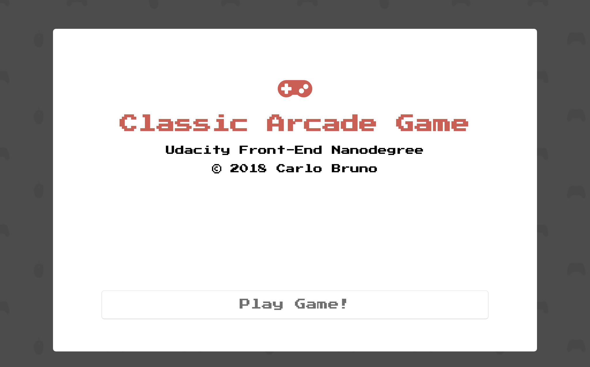
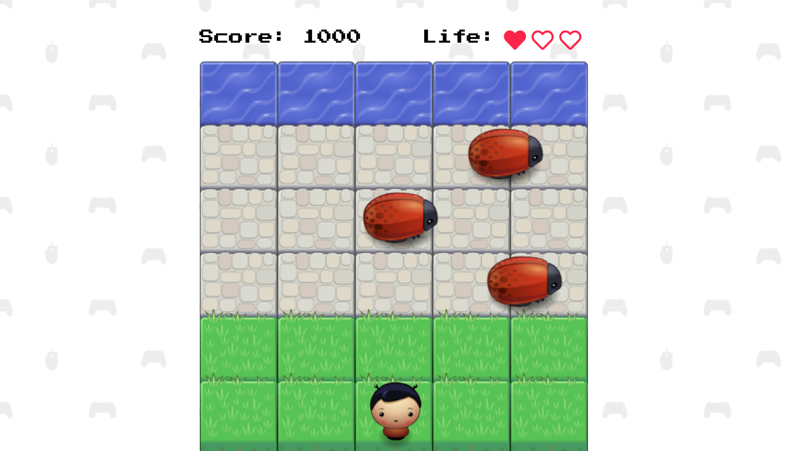

# Classic Arcade Game

## Carlo Bruno | Udacity Front End Nanodegree
### Project \#3 Frogger Game

[DEMO](https://carlo-bruno.github.io/frontend-nanodegree-arcade-game/)

## Table of Contents

* [Introduction](#introduction)
* [Built With](#built-with)

## Introduction

A game program based on the classic arcade game [Frogger](https://en.wikipedia.org/wiki/Frogger). The goal is to guide the player character to the water while avoiding the bugs.

### How to Play

Click the 'DEMO' link above to start the game in your browser.
Control the player character using **UP**,**DOWN**,**LEFT** and **RIGHT** arrow keys.

Players are given 3 hearts. When a collision happens, the player will restart to the beginning cell and one life will be deducted.

Every time the player reaches the water their points will be increased by 100 and they are transported back to the beginning cell. The enemy bugs will gain increased speed as well.

When the player runs out of lives, a game over screen appears, showing the **Final Score**, and an option to play again.

#### A Udacity Project

Project forked from [Udacity](https://github.com/udacity/frontend-nanodegree-arcade-game).

Udacity provided minimal HTML and CSS files. The JS files _resources.js_, _engine.js_, and _app.js_ are also provided.

_resources.js_ contains the image loading utility. _engine.js_ provides the loop functionality and draws the canvas as well as the entities on the screen, and updates them over and over.

_app.js_ defines the Enemy class and two other functions, as well as an event listener function for key press. It also contain comments as clues on how to structure the program.

For a more detailed instruction, check out this [guide](https://docs.google.com/document/d/1v01aScPjSWCCWQLIpFqvg3-vXLH2e8_SZQKC8jNO0Dc/pub?embedded=true) from Udacity.

### [Project Rubric](https://review.udacity.com/#!/projects/2696458597/rubric)

## Built With

+ HTML
+ CSS
+ JavaScript ES6

Toolkits
+ Google Fonts [Press Start 2P](https://fonts.google.com/specimen/Press+Start+2P)
+ [Font Awesome](https://fontawesome.com/) Icons
+ Subtle Patterns [Gaming](https://www.toptal.com/designers/subtlepatterns/gaming/)

Ideas and Tutorials
+ 2D Collision Detection from [Mozilla](https://developer.mozilla.org/en-US/docs/Games/Techniques/2D_collision_detection)

+ Blinking "Play Game" button from a [Stack Overflow question](https://stackoverflow.com/questions/16344354/how-to-make-blinking-flashing-text-with-css-3)

